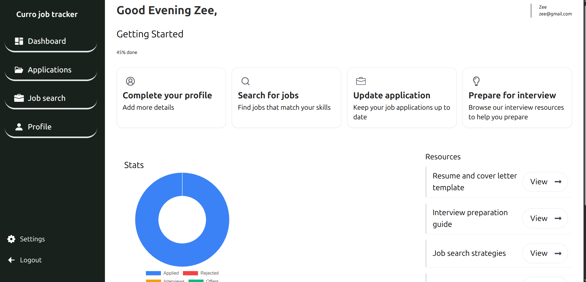
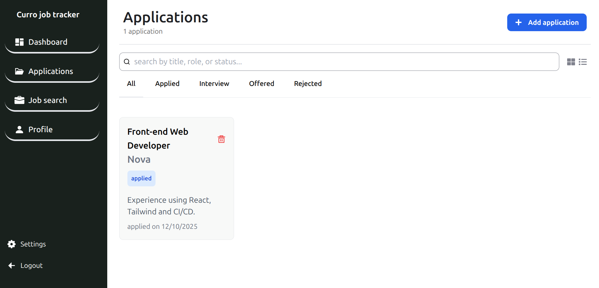
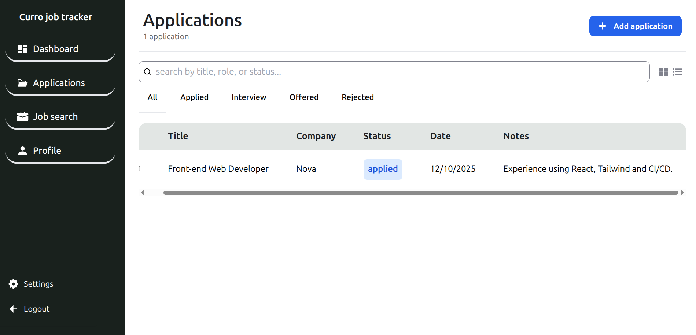
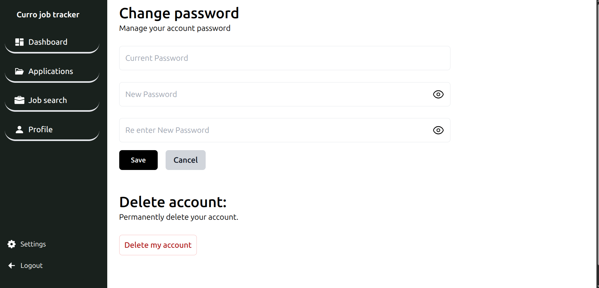

# **Job Application Tracker**

This web application is designed to help users keep track of their job applications. It allows users to add, manage, and organize their job applications efficiently. The application features a clean and responsive design, offering an intuitive user experience for managing job search activities.

## Features

### Dashboard

- Sidebar Navigation: Easy access to the main sections: Applications, Profile, Settings, Logout.

- Profile Progress: A progress indicator that shows the percentage of the profile that has been completed (e.g., 45% complete).

- Personalized Greetings: Displays the user's name and email when they are logged in and have registered.

- Stats: Visual representations of application statuses (e.g., Applied, Interviewed, Offered, Rejected) to track progress.

- Resources: A collection of useful links to resources such as Interview Preparation blogs.

### Applications Page

- Search and Filter: Easily search and filter applications by job title, company, or status.

- Add Application: Allows users to add new applications with essential details like job title, company, application date, and current status.

- Update/Delete Application: Users can update application details or remove applications from their list.

- Toggle UI Views: Switch between list view and card view to display job applications based on personal preference.

### Profile Page

- Profile Completion: Displays a progress bar to track profile completion, encouraging users to fill in their details.

- Editable Fields: Users can update their profile information, such as name, email, and professional details.

### Settings Page

- User Preferences: Manage settings such as notification preferences or account details.

### Logout

- Logout Option: Users can log out from the application when finished.

### Technologies Used

- React.js

- React Router

- Tailwind CSS

- React Icons

- Chart.js

## **How to Run the Project**

1. **Clone the repository**:
   <<<<<<< HEAD
   ```bash
   git clone https://github.com/moysser/curro.git
   cd curro
   ```
2. **Install dependencies**:
   ```bash
   npm install
   ```
3. **Start the development server**:
   ```bash
   npm run dev
   ```
4. **Open the application**:
   - Navigate to `http://localhost:3000` in your web browser.

## **Usage**

### Dashboard

- After logging in, the Dashboard shows a summary of your profile completion, application stats, and a greeting with your name and email.

- The Sidebar provides quick access to sections like Applications, Profile, Settings, and Logout.

- You can view your stats and see your job application progress over time, with visual representations of where each application stands.

### Applications Page

- Search for applications by job title, company name, or application status.

- Filter applications based on their current stage (e.g., Applied, Interviewed, Offered, Rejected).

- Toggle between List View and Card View for displaying applications, based on your preference.

- You can add new applications, update existing applications, or delete applications as needed.

### Profile Page

- Fill out or update your personal profile information.

- View the profile completion progress bar to track how much of your profile is filled out.

### Settings Page

- Update your settings such as notification preferences, password, and other account-related information.

### Logout

- Use the Logout option to sign out of the application.

### Contributing

We welcome contributions! If you would like to contribute to the development of this project.

### Screenshots

<div align="center">
   
   
   
   
</div>
